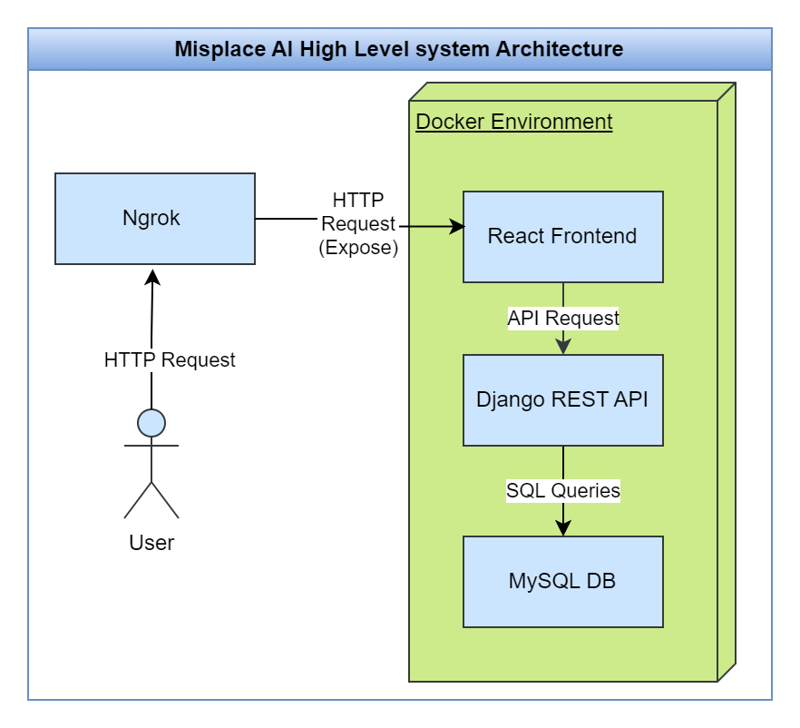
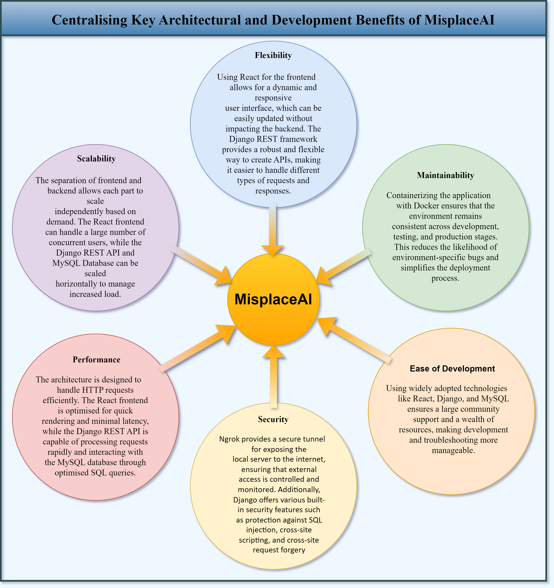
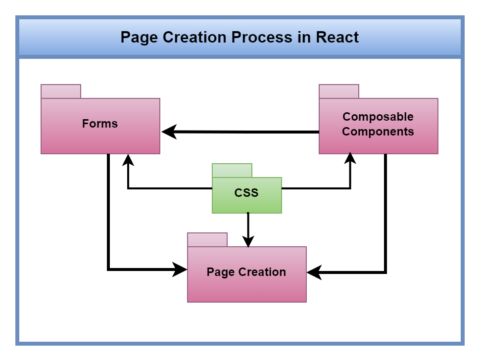
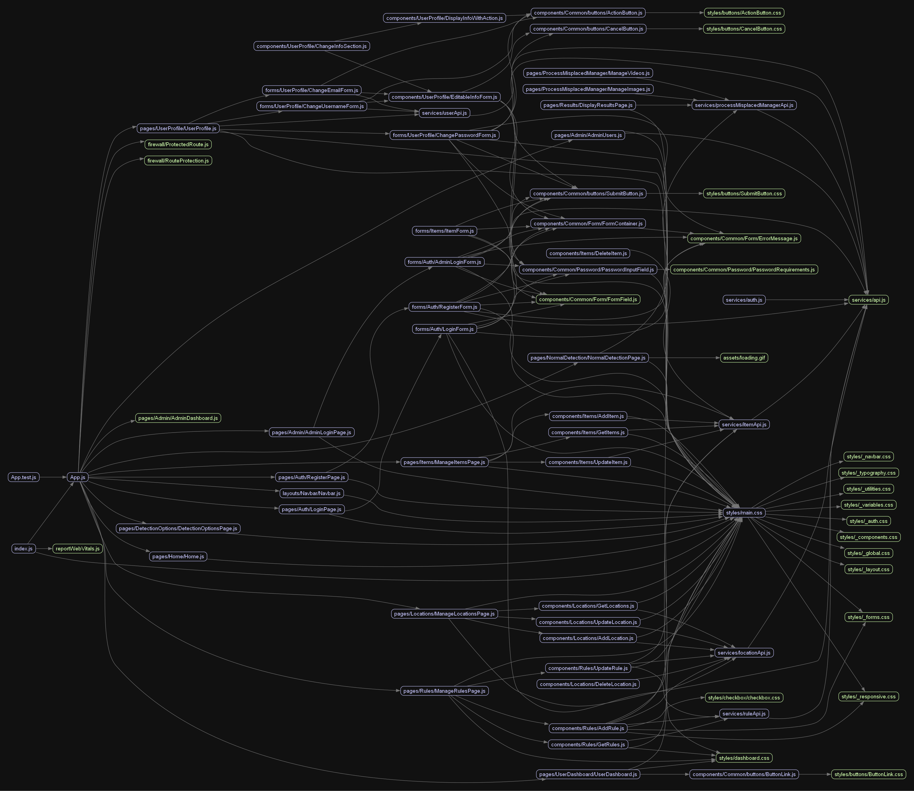
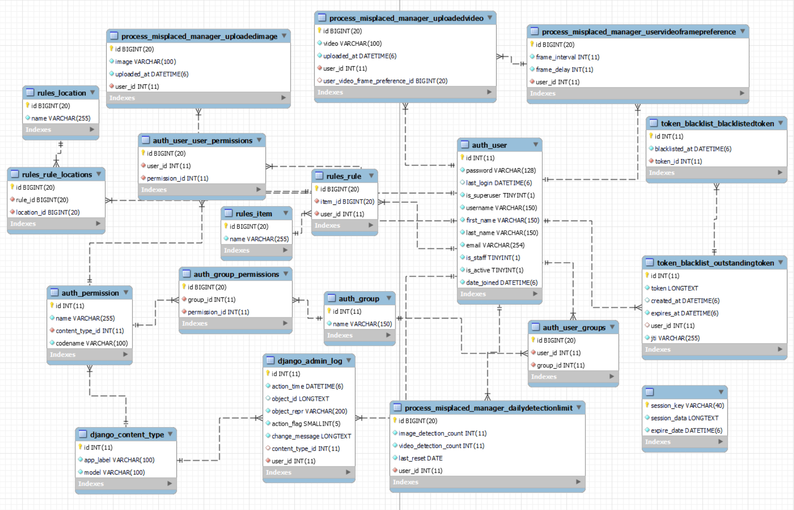
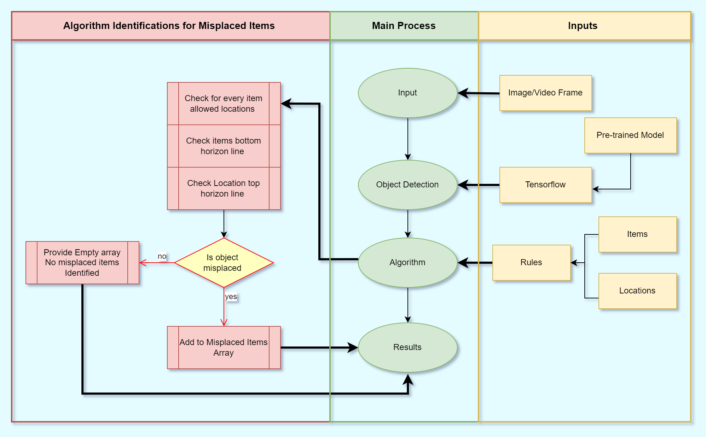
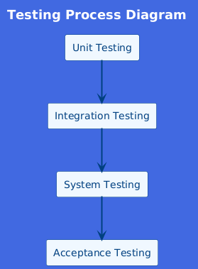

# High-Level System Architecture

The high-level system architecture of the MisplaceAI system is illustrated below. This architecture demonstrates how the different components of the system interact with each other.

The system is composed of the following key components:

1. **User:** The end user interacts with the system through HTTP requests.

2. **Ngrok:** Ngrok is used to expose the local server to the internet, enabling the system to receive HTTP requests from users.

3. **React Frontend:** The user interface of the system, built using React. It handles user interactions and sends API requests to the backend.

4. **Django REST API:** The backend server, implemented using the Django REST framework. It processes API requests from the React frontend and performs the necessary operations.

5. **MySQL Database:** The database that stores the data required by the system. The Django REST API interacts with this database through SQL queries.

These components are containerised and run in a Docker environment, ensuring consistency across different development and production environments.

# Key Architectural and Development Benefits

The following diagram provides a detailed overview of the key architectural and development benefits of the MisplaceAI system. It highlights the core advantages related to Scalability, Flexibility, Maintainability, Security, Performance, and Ease of Development.

In summary, this architecture provides a scalable, flexible, maintainable, secure, and high-performance system, suitable for developing and deploying the MisplaceAI system.

# React Front-end Design

The React frontend architecture is designed to facilitate efficient page creation and management. It utilises reusable composable components, forms, and CSS for styling, ensuring a clear separation of concerns. Each part of the application is responsible for a specific aspect of the user interface, promoting maintainability and scalability. The following diagram illustrates the page creation process in React.

This architecture supports a streamlined development workflow and enhances the modularity and reusability of the codebase.

Additionally, the interaction between different components, services, and pages in the React frontend is illustrated in the graph below. This graph shows how components connect and interact with each other, as well as their relationships with services and CSS files. The component-based architecture highlights the lines connecting different components, showing the reusable components interacting with other components.

Key highlights:

- **App Component:** Central hub managing routing and overall structure.
- **Pages:** Individual pages like Home, AdminDashboard, and UserDashboard, composed of various components.
- **Components:** Reusable elements such as buttons, forms, and navigation elements.
- **Services:** APIs and services handling data fetching and backend communication.
- **CSS Files:** Style sheets providing visual presentation for components and pages.

Example pages and components:

1. **Home Page:** Entry point of the application, providing an overview and access to main features.
2. **Admin Dashboard:** Central location for admin users to manage items, locations, rules, and user activities.
3. **User Dashboard:** Personalised area for users to manage their profile, view detection results, and interact with the application.

By leveraging composable components and a well-structured architecture, the React frontend ensures a seamless and user-friendly experience for both end-users and administrators.

# MySQL Design

MySQL was chosen for its robustness, scalability, and extensive support for relational database management. The database schema illustrates the interconnected tables and their relationships. Some tables are automatically generated by Django's authentication system, while others are defined in the `models.py` file to meet specific application needs.

Key tables include:

- **auth_user**: Stores user information such as username, password, and email. This table is part of Django's default authentication system.
- **auth_user_user_permissions** and **auth_user_groups**: Manage user permissions and group memberships, also part of Django's authentication system.
- **token_blacklist_blacklistedtoken** and **token_blacklist_outstandingtoken**: Handle user authentication tokens.
- **rules_location**: Defines locations associated with specific rules, created from custom models.
- **rules_item**: Defines individual rules and their properties, created from custom models.
- **django_admin_log**: Manages administrative actions, part of Django's admin framework.
- **django_content_type**: Maintains content types used by the admin interface, part of Django's admin framework.
- **process_misplaced_manager_dailydetectionlimit**: Tracks daily detection limits per user, defined in `models.py`.

This structured approach ensures efficient data management, enhanced security, and seamless integration across various system components.

# System Design for Misplaced Item Detection

The system for detecting misplaced items integrates several components to ensure efficient and accurate identification. The process begins with the input stage, where images or video frames are fed into the system from various sources. In the object detection phase, TensorFlow and pre-trained models identify objects within the frames. These models recognise common objects and output their coordinates, which are essential for the next step.

The algorithm processes these coordinates against predefined rules based on items and their allowable locations. The algorithm checks each detected item's position against the allowed positions, examining their top and bottom horizon lines to determine misplacements. A detailed sub-process within the algorithm verifies the position of each item and compares it to the predefined rules. Misplaced items are added to a misplaced items array, while correctly placed items are disregarded. In the results phase, the system compiles the output, highlighting misplaced items and their coordinates. This information is visualised for the user by marking misplaced items in red, allowing quick identification and correction.

This design, incorporating advanced technologies and a robust algorithm, provides a comprehensive solution for detecting misplaced items across various environments.

  

# Testing Design

The testing phase followed the Kanban agile methodology, ensuring each test was completed before moving to the next task. This approach covered both functional and non-functional requirements.

## Testing Levels

### Unit Testing

Individual components or units of the system are tested in isolation to ensure they function as expected.

### Integration Testing

Different components of the system are tested together to ensure they work correctly as a whole.

### System Testing

The complete system is tested to ensure it meets the specified requirements.

### Acceptance Testing

The system is validated against user requirements to ensure it meets the needs of end-users and stakeholders.

## Tools Used

- **Backend**: Pytest for testing the Django REST API.
- **Frontend**: Mocha for testing the React components.

By using these testing tools, we ensured a rigorous and systematic validation process, addressing all requirements and identifying issues early in development.

